# LEMP Deployment on Ubuntu using Nginx Webserver
## Introduction
This project demonstrates how to deploy a **LEMP stack (Linux, Nginx, MySQL, PHP)** on an **Ubuntu EC2 instance**. It covers setting up the Nginx web server, installing PHP and database support, and hosting a simple PHP application.

## Prerequisites
- AWS account with an Ubuntu EC2 instance (t2.micro recommended)
- SSH key (.pem) to connect
- Security group with SSH (22) and HTTP (80) open
- Basic Linux knowledge and a web browser for testing

## Steps to Deploy LEMP Stack
### Step 1: Connect to EC2 Instance
Go to the folder where your SSH key (.pem) is saved, open Git Bash there, and run
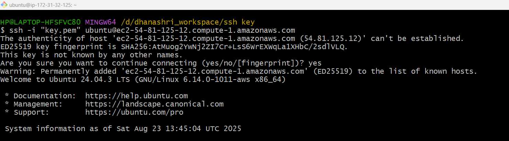

### Step 2: Update System and Install Nginx
1. Update the System
```bash
sudo apt update
```
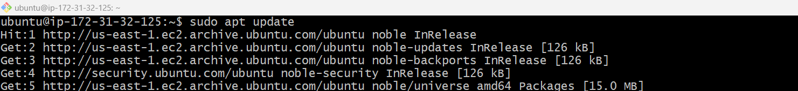
2. Install the nginx Server
```bash
sudo apt install nginx -y
```
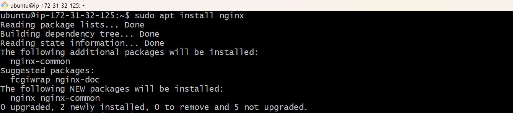
3. Start, enable and check status of server
```bash
sudo systemctl start nginx
sudo systemctl enable nginx
sudo systemctl status nginx
```
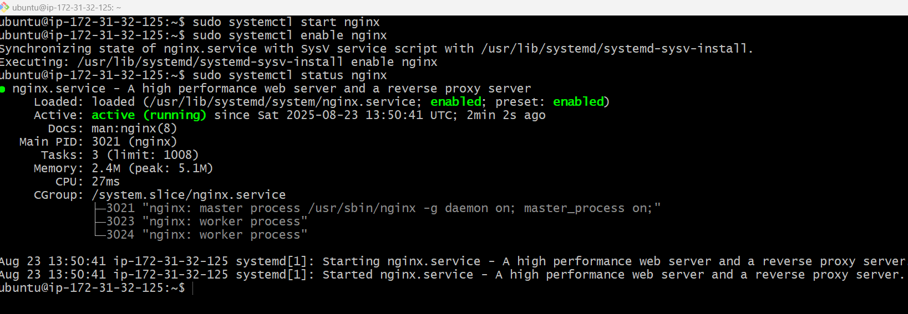

### Step 3: Install mysql
1. Search for mysql
```bash
sudo apt search mysql
```
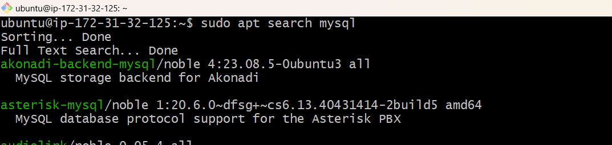
2. Install mysql-server
```bash
sudo apt install mysql-server -y
```
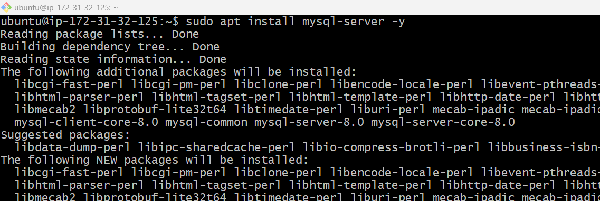

### Step 4: Install PHP
1. Search for php
```bash
sudo apt search php
```
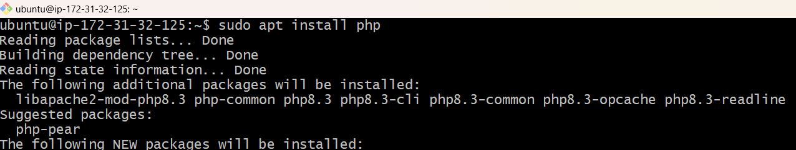
2. Check the version of php and install php-fpm
```bash
php --version
sudo apt install php8.3-fpm -y
```
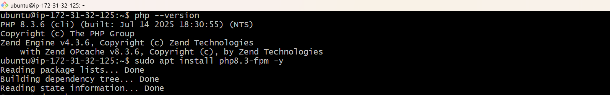
3. Start, enable and check status of php8.3-fpm
```bash
sudo systemctl start php8.3-fpm
sudo systemctl enable php8.3-fpm
sudo systemctl status php8.3-fpm
```
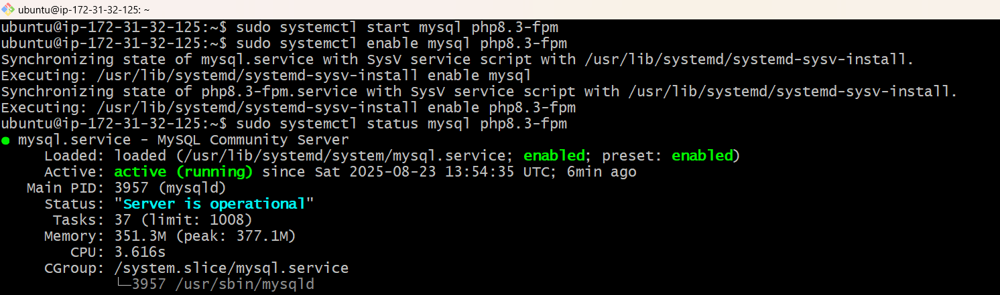

### Step 5: Go into the default directory /var/www/html/ and create an index.html and index.php file for testing.
1. Create index.html and index.php
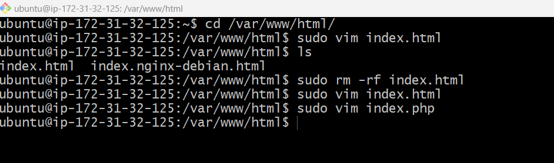
2. Add content in index.html
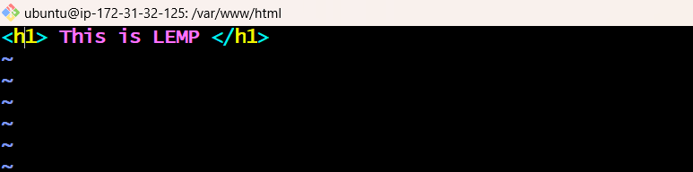
3. Add content in index.php
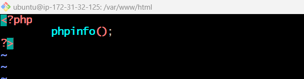

### Step 6: Restart **nginx, mysql, php8.3-fpm**
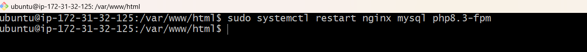

### Step 7: Copy the Public IP Address and paste in any browser for testing deployment.
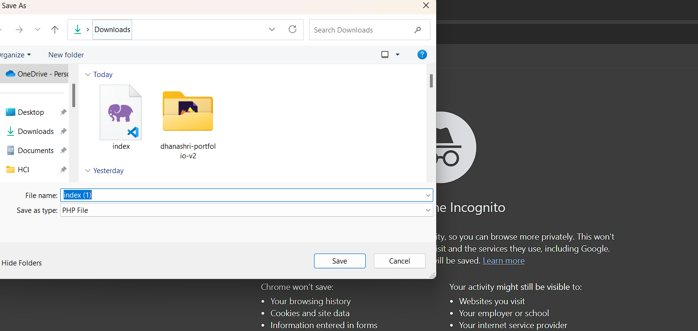
On Ubuntu LEMP (Nginx + PHP), if your .php file is getting downloaded instead of executing, it means Nginx is not configured to process PHP through PHP-FPM.

### Step 8: Fix for PHP Download Issue in Nginx
1. Change Directory to `/etc/nginx/sites-enabled/`and go to default file. 
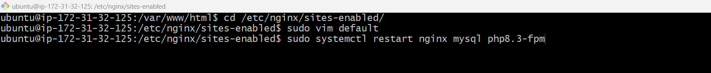
2.Inside the default Nginx config file, uncomment the PHP location block and update the PHP-FPM version to match your installed PHP version.
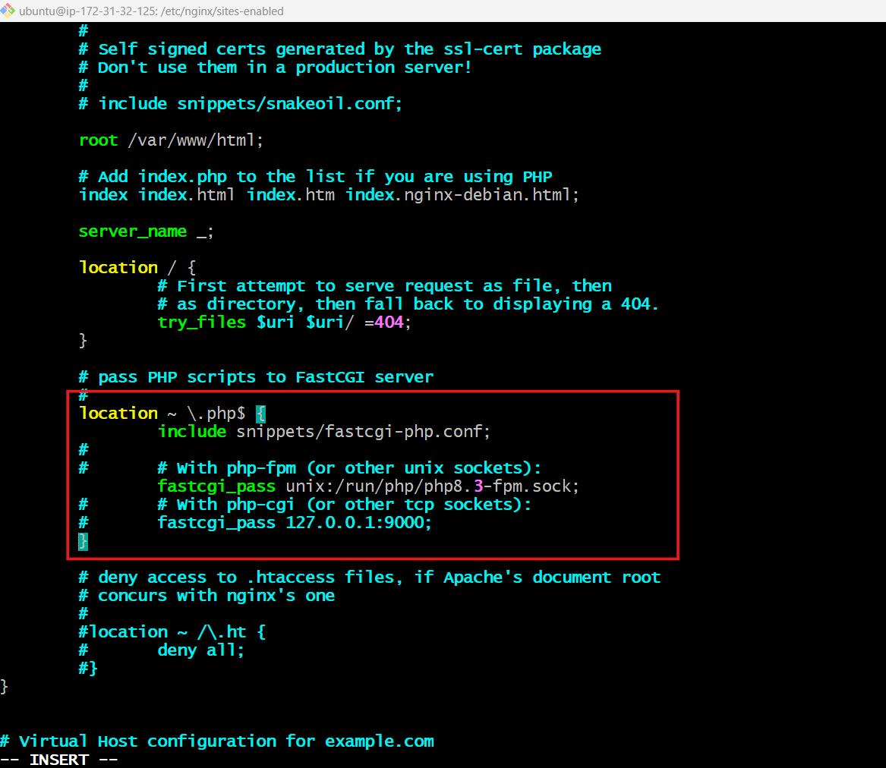

### Step 9: Restart **nginx, mysql, php8.3-fpm**


### Step 10: Testing the Deployment
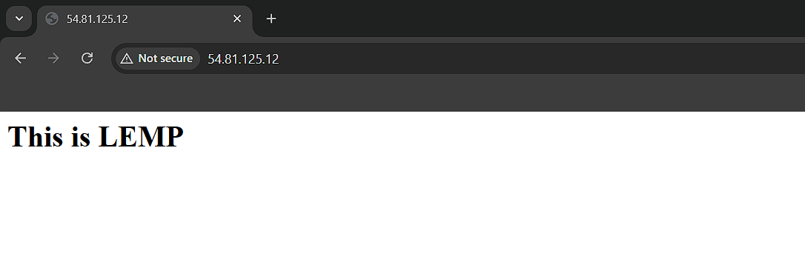

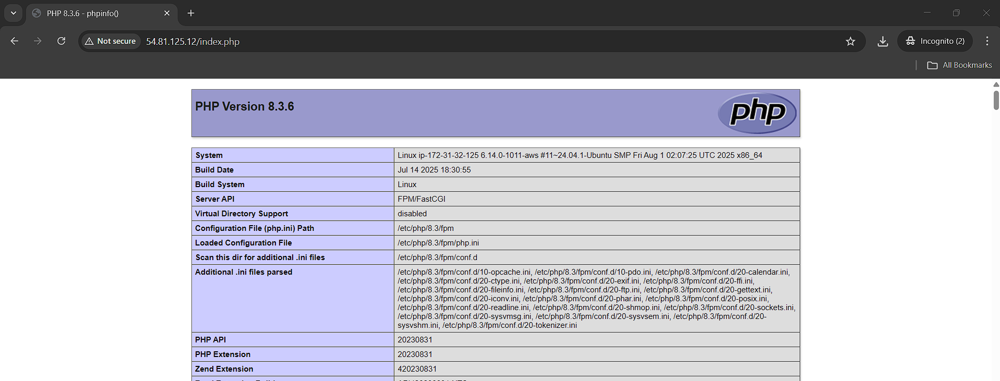

## Summary
In this project, we deployed a **LEMP** stack on Ubuntu using the Nginx webserver. We connected to an EC2 instance via SSH, installed and configured **Nginx, PHP, and MySQL,** and set up the default directory`/var/www/html/` with test HTML and PHP files. We also configured Nginx to work with PHP-FPM to ensure PHP files execute properly instead of downloading.


